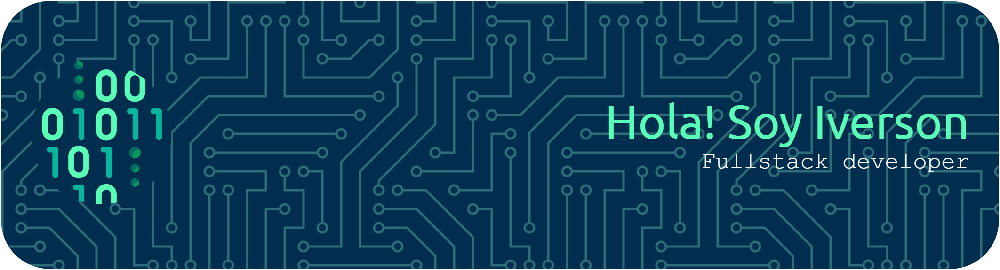

# 👋 ¡Hola! Soy Iverson Tarazona

### 🚀 Sobre mí
Soy un desarrollador **Full Stack Junior** de Cúcuta, Colombia 🇨🇴. Me apasiona crear soluciones web modernas y escalables. Actualmente enfocado en perfeccionar mi stack con Angular 21 y Java.

---

### 🛠️ Tecnologías y Herramientas

| Categoría | Tecnologías |
| :--- | :--- |
| **Frontend** | Angular, TypeScript, JavaScript, HTML5, CSS3, Tailwind CSS |
| **Backend** | Java, PHP, SQL (MySQL, SQL Server, Oracle) |
| **Herramientas** | Git, GitHub, Vercel |

---

### 📈 Mi Actividad en GitHub

Aquí puedes agregar tus tarjetas de estadísticas usando las herramientas que vimos:
- **Estadísticas Generales:** Agrega tu tarjeta de `github-readme-stats` con tu nombre de usuario.
- **Lenguajes más usados:** Agrega la tarjeta de lenguajes del mismo proyecto.

---

### 📬 Conectemos
- **LinkedIn:** [Iverson Tarazona](https://linkedin.com/in/iverson-tarazona-contreras)
- **Portafolio:** [Mi Web](https://portafolio-one-bay.vercel.app)
